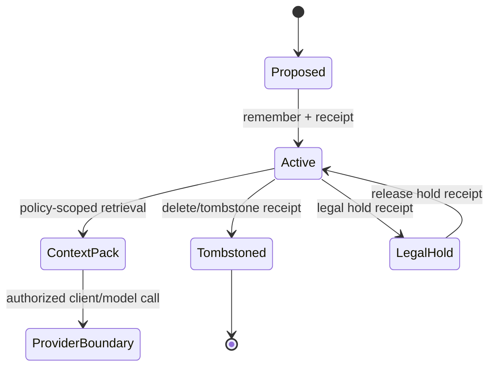
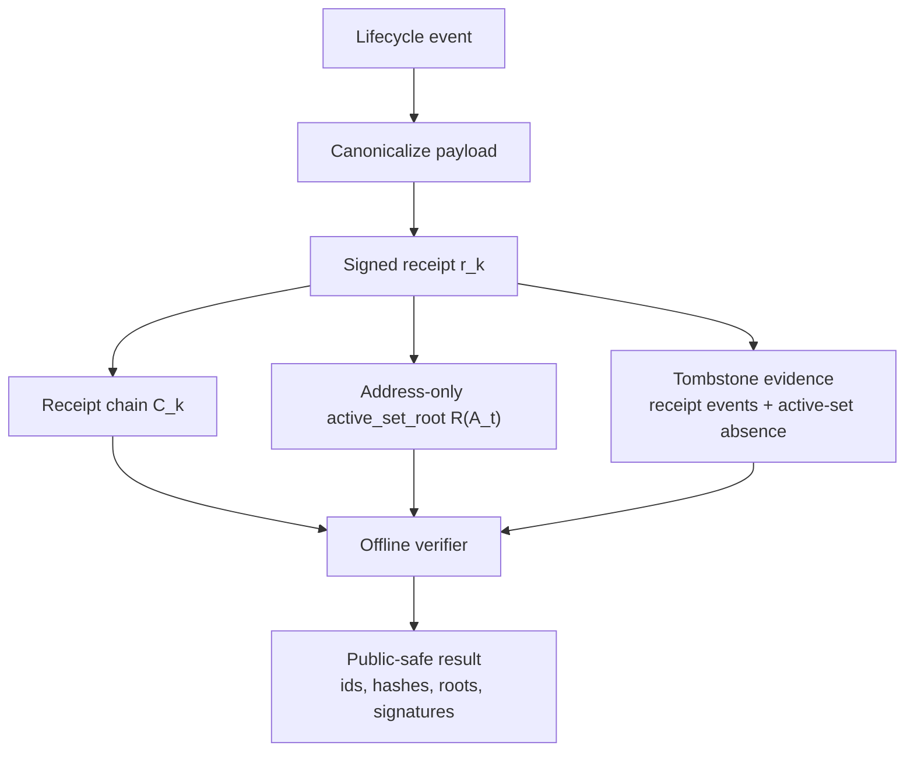
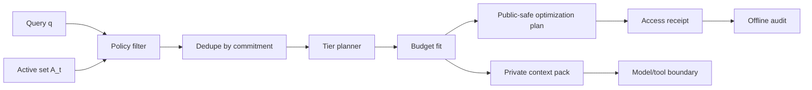
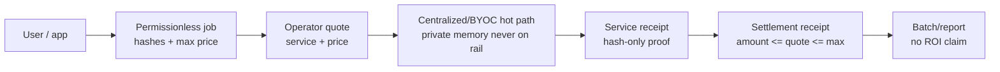
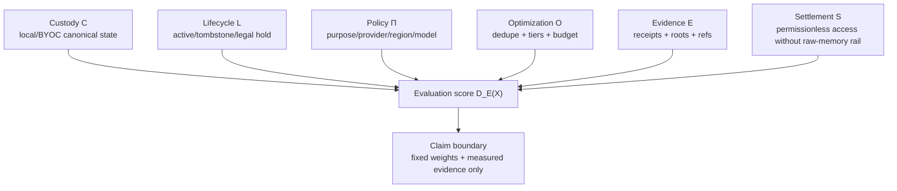

# Enigma Memory technical whitepaper

## Abstract

Enigma Memory is a provider-neutral memory custody, optimization, and proof layer for AI systems. Its core claim is narrow: Enigma can maintain a canonical local/BYOC memory state, produce signed receipts for Enigma-mediated lifecycle events, select scoped context for a model boundary, and emit plaintext-minimized optimization evidence that estimates context reduction for explicit inputs.

Enigma does **not** claim provider-side deletion, model forgetting, universal invoice savings, token ROI, compliance status, tamper-proof hardware, or raw compute superiority. The strongest architecture is deliberately non-ideological: centralize the hot-path memory optimizer where latency, privacy, and cost control matter; use permissionless rails only for access, settlement, and opaque commitment anchoring where they add value.

## 1. Problem

Stateful AI creates a new infrastructure layer between users, organizations, applications, and models. That layer must decide:

- which memories are active,
- which memories are tombstoned or legally held,
- which memories may cross a provider/model/purpose boundary,
- which memories should be sent as full context,
- which memories should be compacted or represented only by proof material,
- which evidence can be verified later without exposing raw memory.

Provider-native memory, vector databases, prompt compressors, and model routers each solve part of the problem. None is, by default, a portable canonical memory ledger with local custody, lifecycle receipts, policy-scoped context packs, and offline verifier material.

## 2. System model

Let a tenant or subject have an Enigma memory universe:

$$
M_t = \{m_1, m_2, \dots, m_n\}
$$

Each memory `m_i` has:

$$
m_i = (a_i, h_i, p_i, s_i, \ell_i, \mu_i)
$$

where:

- `a_i` is the committed memory address,
- `h_i` is a content commitment or hash,
- `p_i` is policy metadata such as purpose, sensitivity, provider boundary, region, and tenant,
- `s_i \in \{active, tombstoned, legal_hold\}` is lifecycle state,
- `\ell_i` is local/BYOC location metadata or opaque storage reference,
- `\mu_i` is receipt and provenance metadata.

The active serving set is:

$$
A_t = \{m_i \in M_t \mid s_i = active\}
$$

The tombstone set is:

$$
D_t = \{m_i \in M_t \mid s_i = tombstoned\}
$$

The legal-hold set is:

$$
L_t = \{m_i \in M_t \mid s_i = legal\_hold\}
$$

Enigma's operational invariant is:

$$
A_t \cap D_t = \varnothing, \quad A_t \cap L_t = \varnothing \text{ when legal hold forbids serving}
$$

A provider/model call receives only a scoped context pack derived from `A_t` under policy. Tombstoned memory can remain in the audit log, but it must not remain in the active serving set.



## 3. Commitment and receipt chain

A memory lifecycle event emits a receipt:

$$
r_k = H(type_k \parallel payload_k \parallel previous_k \parallel policy_k \parallel time_k)
$$

The receipt chain root after `k` events is:

$$
C_k = H(C_{k-1} \parallel r_k)
$$

The implemented `active_set_root` is the Merkle-set root over active memory addresses only:

$$
R(A_t) = MerkleSetRoot( sort( \{a_i : m_i \in A_t\} ) )
$$

This root intentionally does **not** commit plaintext, content hashes, policy text, or tombstone objects as separate receipt fields. Content and policy facts live in signed event hashes and receipts; deletion/tombstone evidence is represented by the event stream, tombstone state, active-set absence, exported bundles, and optional checkpoints.

The implemented receipt verifier checks `event_hash`, `previous_receipt_hash`, `active_set_root`, `receipt_log_root`, signer object, signature, sequence, and root continuity. A verifier does not need raw memory to check those boundary facts, but it also must not infer provider-side erasure, model forgetting, or a separate signed tombstone root.



## 4. Context selection and optimization

A request arrives with query `q`, purpose `u`, provider/model boundary `b`, and optional prompt-token budget `B`. Policy filters the active set:

$$
M' = \{m_i \in A_t \mid Policy(m_i, u, b) = allow\}
$$

The naive baseline prompt cost is:

$$
T_{base} = T(q) + \sum_{m_i \in M'} t_i
$$

where `T(x)` is the deterministic token estimator and `t_i` is the estimated token contribution of memory `m_i`.

The optimizer assigns each memory to a tier:

$$
\tau_i \in \{hot, warm, cold, proof\_only\}
$$

with explicit prompt representation cost:

$$
c(\tau_i, t_i) =
\begin{cases}
 t_i & \tau_i = hot \\
 \min(t_i, \lceil \rho t_i \rceil) & \tau_i = warm \\
 \min(t_i, \kappa) & \tau_i = cold \\
 \min(t_i, \pi) & \tau_i = proof\_only
\end{cases}
$$

The optimized estimate is:

$$
T_{opt} = T(q) + \sum_{m_i \in S} c(\tau_i, t_i)
$$

subject to:

$$
S \subseteq M', \quad T_{opt} \le B \text{ when a budget is supplied}
$$

Estimated token reduction is:

$$
\Delta_T = T_{base} - T_{opt}
$$

Estimated percentage reduction is:

$$
\Delta_{\%} = 100 \cdot \frac{\max(0, \Delta_T)}{\max(1, T_{base})}
$$

If a user supplies an input-token price `r` per one million tokens, request-local estimated cost is:

$$
C(T,r) = \frac{T}{1{,}000{,}000}r
$$

For production billing and settlement evidence, Enigma records content-minimized usage events with only counts and refs:

$$
u = (tenant, provider, model, T_{prompt}, T_{out}, T_{base}, T_{opt}, r_{in}, r_{out})
$$

The metered Enigma-side memory credit is deterministic:

$$
Credit(u)=\frac{(T_{base}-T_{opt})r_{in}}{1{,}000{,}000}
$$

with the invariant:

$$
0 \le T_{opt} \le T_{base}
$$

This is deliberately not a provider invoice guarantee. It is the auditable local/BYOC meter for Enigma-side usage math, settlement receipts, and customer reporting.

The implemented benchmark command is:

```sh
npm run memory:benchmark
```

It emits `enigma.memory_optimization_benchmark.v1` plus `enigma.memory_strategy_comparison.v1`. The benchmark compares full-context unverified recall, deduped unreceipted recall, and the Enigma receipted plan on a repository fixture. It is not a public invoice benchmark or universal discount claim.



### 4.1 Permissionless access and service settlement

The production network does not need to decentralize raw inference to get permissionless access. Enigma can expose an open service job boundary:

$$
job=(tenant, job\_type, memory\_root, policy\_hash, usage\_hash, max\_price, asset, expiry)
$$

Operators answer with quotes:

$$
quote=(job\_hash, operator, service\_kind, price, asset, capacity\_ref, terms\_ref)
$$

and completed work settles through a receipt:

$$
settlement=(job\_hash, quote\_hash, usage\_hash, memory\_root, policy\_hash, amount, asset, service\_receipt)
$$

The invariant is:

$$
settlement.amount \le quote.price \le job.max\_price
$$

and the public payload remains:

$$
PublicSettlement=\{job\_hash, quote\_hash, usage\_hash, memory\_root, policy\_hash, amount, asset, refs\}
$$

No prompt, completion, provider response, transcript, credential, or decrypted memory enters the settlement artifact. This preserves the price/access advantages of a service market without leaking the hot path or pretending token mechanics imply ROI.



### 4.2 Consumer GPU memory-market boundary

The useful version of consumer GPU participation is not ideological decentralization. It is priced capacity discovery for memory-optimization work whose public artifact is a bounded capacity profile:

$$
capacity=(operator, accelerator, region, model\_family, vram, tokens/min, p95, price, asset, capacity\_ref)
$$

The implemented `enigma.consumer_gpu_capacity_profile.v1` object carries only capacity, pricing, model family, and refs. It explicitly records:

$$
raw\_memory\_access=false,\quad decentralization\_claim=false,\quad provider\_discount\_claim=false
$$

An operator can attach the profile to a `memory_optimizer` quote, but the quote still settles under the same invariant:

$$
settlement.amount \le quote.price \le job.max\_price
$$

This gives permissionless access to capacity and settlement without pushing raw memory, private prompts, or provider responses onto public rails.

## 5. How Enigma differs from adjacent systems

### 5.1 Provider-native memory

Provider-native memory is convenient but locked to one account and provider boundary. Enigma's advantage is portability and verifier material. It can prove Enigma-side receipt chains, address-only active-set roots, deletion/tombstone events, policy-scoped retrieval, and gateway decisions without trusting one provider dashboard.

### 5.2 Vector databases and RAG

Vector databases retrieve chunks. They do not, by default, define canonical memory lifecycle state, tombstone receipts, legal-hold exclusion, provider-boundary policy, access receipts, or offline proof bundles. Enigma can use retrieval techniques, but the product boundary is the durable memory ledger plus scoped context delivery.

### 5.3 Prompt compression

Prompt compression rewrites text. Enigma's optimizer decides what should be full context, compact context, cold pointer, or proof-only evidence under memory lifecycle and policy constraints. The optimizer output is itself auditable.

### 5.4 Fully decentralized memory

Putting raw memory or hot retrieval across decentralized infrastructure sacrifices latency, privacy, and cost control. Enigma's design keeps the hot path centralized or BYOC-controlled. Permissionless systems can be useful at the edge: access, settlement, transparent operator accountability, and anchoring opaque commitments. They should not own raw memory by default.

### 5.5 Model routers

Model routers optimize model choice. Enigma optimizes memory before model choice. It can reduce repeated context and provide evidence regardless of which model provider handles the final call.

### 5.6 Memory-layer evaluation framework

For a candidate memory system `P`, define the production memory capability vector:

$$
V(P) = (C, L, \Pi, O, E, S)
$$

where:

- `C` = custody control;
- `L` = lifecycle enforceability;
- `\Pi` = policy expressiveness;
- `O` = context optimization behavior;
- `E` = external verifier evidence;
- `S` = settlement/access separation.

For an adjacent system `X`, Enigma can be evaluated with a pre-registered weighted score:

$$
D_E(X)=
w_C(C_E-C_X)+
w_L(L_E-L_X)+
w_{\Pi}(\Pi_E-\Pi_X)+
w_O(O_E-O_X)+
w_E(E_E-E_X)+
w_S(S_E-S_X)
$$

with weights:

$$
w_i \ge 0, \quad \sum_i w_i = 1
$$

This is an evaluation framework, not a theorem of universal superiority. A deployment may claim `D_E(X) > 0` only after it defines fixed weights, records measured scores for both Enigma and the adjacent system, and publishes the evidence refs used for those scores. Without that measured packet, the current evidence supports a narrower architectural claim: Enigma packages a bundle of custody, lifecycle state, policy-scoped serving, context efficiency, verifier evidence, and settlement separation in one memory layer, while each adjacent class usually emphasizes only part of that bundle.



## 6. Privacy and leakage model

Private context can contain raw memory only when an authorized local/BYOC/client boundary requests it. Public evidence must be minimized:

$$
PublicEvidence = \{address, commitment, receipt\_id, root, policy\_hash, tier, token\_estimate, cost\_estimate\}
$$

Raw memory is excluded:

$$
RawMemory \notin PublicEvidence
$$

Production readiness evidence follows the same rule. Backend manifests and `/readyz` may include public-safe `evidence_refs`, but not tokens, private keys, DSNs with embedded credentials, prompts, transcripts, decrypted capsules, or raw memory.

## 7. Production readiness boundary

A hosted deployment is not ready because code exists. Hosted readiness requires:

- public `/livez` and `/readyz` probes only,
- private admin/data-plane ingress,
- durable storage,
- KMS or secret custody,
- monitoring and alerting,
- SIEM or log sink,
- backup target and backup/restore drill evidence,
- runtime/admin/data-plane auth,
- network-access policy,
- KMS custody approval,
- tenant-policy approval,
- usage metering,
- service settlement,
- public-site security validation,
- security threat model review,
- legal/compliance approval,
- support/SLA approval,
- incident drill,
- operator acceptance,
- no external blockers.

Enigma's readiness tools intentionally fail closed. `hosted_live_ready` may become true only when the manifest contract is complete, all hosted refs are present, requested live checks pass, credentialed Cloudflare/project observation passes where required, operator acceptance is `go`, and blockers are empty.

## 8. Claim boundary

Enigma can claim:

- portable local/BYOC memory custody primitives,
- Enigma-side receipts and roots,
- policy-scoped context packs,
- plaintext-minimized optimizer plans and access receipts,
- deterministic fixture benchmark and strategy-comparison evidence from `npm run memory:benchmark`,
- production readiness blockers and refs when observed.

Enigma must not claim without separate evidence:

- provider-side deletion,
- model forgetting,
- universal cost discounts,
- provider invoice savings,
- token ROI,
- legal/compliance certification,
- tamper-proof hardware,
- live hosted backend readiness before production dependencies are actually provisioned and verified.

## 9. Conclusion

The durable memory layer is more valuable than another model wrapper. Enigma's thesis is that memory should be portable, policy-scoped, optimized before inference, and verifiable after the fact. Centralized or BYOC hot-path optimization preserves performance and privacy; permissionless access and settlement can remain outside the raw-memory path. That boundary is the moat: memory quality, context efficiency, receipts, and production proof without pretending that decentralization or provider claims solve everything.
