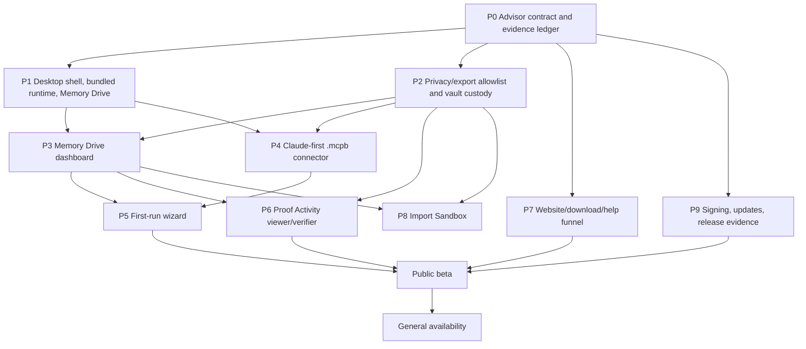

# Workflowz execution roadmap

This roadmap converts the launch research into deterministic workflowz phases for a frictionless general-public launch. The wedge is deliberately narrow: signed desktop app first, Claude Desktop first, local Memory Drive first. Everything else either reduces that path's friction now or waits.

Source basis: `docs/GENERAL_PUBLIC_LAUNCH_GOAL.md`, `docs/GENERAL_PUBLIC_LAUNCH_WORKPLAN.md`, existing `docs/public-launch/*.md`, and the internal research/advisor artifacts for desktop, Claude `.mcpb`, website funnel, dashboard, import, release infrastructure, proof viewer, Memory Controller category, and Advisor governance.

## Launch invariant

A phase cannot promote if the default public path requires terminal, Node, npm, source checkout, provider key, cloud account, or manual MCP JSON. Public copy and shareable artifacts may claim only Enigma-controlled local facts: local Memory Drive lifecycle, connector setup/repair status, local proof summaries, signed installer/update status, health checks, sanitized support codes, and public-safe evidence metadata.

The roadmap must not claim provider deletion, provider-native memory removal, model forgetting, hosted SaaS/BYOC readiness, compliance certification, benchmark superiority, legal/patent conclusions, or chain submission unless separate evidence exists for that exact claim.

## Deterministic phase graph

### Exact build order

| Order | Phase | Serial dependency | Parallel workstreams | Acceptance | Test/evidence gate |
| --- | --- | --- | --- | --- | --- |
| P0 | Advisor contract and evidence ledger | None. This is the standing governor. | Claim ledger, friction budget, privacy/export allowlist, phase evidence template, ship/hold/rollback rubric. | Every phase has owner, entry criteria, exit criteria, allowed public claims, forbidden fields, and a named evidence packet. | `EV-P0-LAUNCH-LEDGER`: phase checklist with public-safe fields, Advisor decision slot, privacy review slot, claim review slot. |
| P1 | Desktop shell, bundled runtime, Memory Drive | Starts after P0. All consumer UI depends on its typed app actions. | Tauri/equivalent shell, bundled Enigma sidecar/runtime, current-user local control channel, OS app-data Memory Drive, vault retention on normal uninstall, offline local health/proof actions. | Clean supported Windows/macOS profiles can install, launch, create or detect a Memory Drive, show local health, relaunch offline, and quit without Node/npm/terminal/JSON. UI never builds shell strings from user input. | `EV-P1-CLEAN-INSTALL-NO-DEV-TOOLS`, `EV-P1-OFFLINE-MEMORY-DRIVE`, `EV-P1-VAULT-RETENTION-REINSTALL`. |
| P2 | Privacy/export allowlist and vault custody | Can run in parallel with P1, but P3-P8 cannot expose share/export surfaces until this exists. | Shared forbidden-field scanner, diagnostics/proof/import/evidence projection allowlists, path labeler, local-only diagnostic preview, OS keychain or equivalent custody default, fail-closed export blocker. | No support bundle, proof export, import receipt, screenshot fixture, or release evidence packet can include raw memory, prompts, transcripts, provider responses, private paths, credentials, tokens, private keys, account IDs, customer identifiers, or signing secrets. | `EV-P2-FORBIDDEN-FIELD-REJECTION`, `EV-P2-DIAGNOSTIC-PREVIEW`, `EV-P2-EXPORT-FAIL-CLOSED`. |
| P3 | Memory Drive dashboard | Requires P1 typed health actions and P2 safe view model. | Health contract, global one-action rollup, Memory Drive card, Connected apps card, Activity details card, Needs review card, fix-it drawer, support-code taxonomy. | A non-technical user can open the app and answer: whether Enigma is ready, which app is connected, and what one action is next. No logs, schemas, hashes, MCP terms, or private paths in default view. | `EV-P3-DASHBOARD-READY-WALKTHROUGH`, `EV-P3-FIX-IT-STATES`, `EV-P3-SUPPORT-SUMMARY-REDACTION`. |
| P4 | Claude-first `.mcpb` connector | Requires P1 local service/pairing contract and P2 redaction. Other connectors wait behind Claude unless they share the engine. | `.mcpb` manifest, stdio bridge, app/service pairing, Claude detect states, install handoff, restart/test connection, repair/reinstall, disconnect guidance, fallback config path only behind Advanced with backup/rollback. | On clean Windows/macOS with current Claude Desktop and no Node/npm/Git, a user can install Enigma Desktop, create a Memory Drive, install the Enigma Claude extension through Claude's extension UI, and verify readiness without editing JSON. | `EV-P4-CLAUDE-MCPB-PACKAGE`, `EV-P4-CLAUDE-HANDSHAKE`, `EV-P4-CLAUDE-REPAIR-ROLLBACK`, `EV-P4-NO-JSON-DEFAULT`. |
| P5 | First-run wizard | Requires P3 dashboard states and P4 at least-one-connector path. | Welcome, create/detect Memory Drive, find apps, connect Claude, health check, ready; resume after close/reopen; permission/no-client/restart/corrupted-config states; accessibility pass. | Default first run uses one primary action per screen and completes without terminal/package/protocol instructions. Every blocking state has one fix or support handoff. | `EV-P5-FIRST-RUN-HAPPY-PATH`, `EV-P5-NO-CLIENT-PATH`, `EV-P5-PERMISSION-FAILURE`, `EV-P5-RESUME-AFTER-REOPEN`. |
| P6 | Proof Activity viewer/verifier | Requires P2 allowlist and enough P1/P3 proof commands to render local evidence. Can run beside P5 after P3. | Public-safe proof activity view model, receipt timeline, context summary, not-shared evidence copy, offline verifier status, export preview/scan, advanced verifier drawer. | Proof Activity shows what Enigma did locally, what evidence exists, and what it does not prove. Default view contains only refs, roots, counts, timestamps/time buckets, schema IDs, verifier status, policy IDs, capability IDs, support codes. | `EV-P6-BETA-PROOF-001`, `EV-P6-OFFLINE-VERIFIER`, `EV-P6-PROOF-EXPORT-BLOCKED-ON-UNSAFE`, `EV-P6-NO-PROVIDER-OVERCLAIM`. |
| P7 | Website, download, help, and in-app copy | IA can start after P0; public claims finalize only after P1/P4/P6/P9 evidence. | Homepage, `/download`, setup guide, install help, Claude help, troubleshooting, privacy, proofs, FAQ, developer CLI appendix, README top-third desktop-first rewrite, synthetic screenshots. | Public path leads with signed desktop download. Consumer pages do not present npm/CLI/source/manual MCP JSON as the default. Unavailable or unsigned artifacts are marked blocked/waitlist, not consumer-ready. | `EV-P7-FIVE-SECOND-PATH`, `EV-P7-CLAIM-BOUNDARY-REVIEW`, `EV-P7-SCREENSHOT-PRIVACY`, `EV-P7-LINK-AND-IA-REVIEW`. |
| P8 | Import Sandbox | Post-setup only. Requires P3 dashboard/empty state and P2 privacy scanner. Not a beta entry blocker unless marketed. | Paste/drag/drop memory list, Claude memory text path, `.txt`/`.md`/safe JSON adapters, ChatGPT export advanced scan-only/quarantine-by-default, dedupe, quarantine, transactional import batch, undo, sanitized receipt. | Import is local-only and read-only until explicit Import. Public-safe receipts include counts, hashes/refs, source type, caveats, duplicate/quarantine totals, and vault receipt refs only. | `EV-P8-CLAUDE-TEXT-IMPORT`, `EV-P8-MALICIOUS-FILE-REJECTION`, `EV-P8-CHATGPT-QUARANTINE`, `EV-P8-RECEIPT-REDACTION`, `EV-P8-IDEMPOTENT-REIMPORT`. |
| P9 | Signing, updates, release evidence | Can start manual prerequisites after P0; blocks beta announcement. | Release-owner checklist, Windows channel decision, publisher identity, Windows signing/Store/MSIX path, macOS Developer ID signing/notarization/stapling, signed update manifests/payloads, channel separation, rollback-safe failure, release evidence packet, support ownership. | Signed Windows beta artifact and signed/notarized macOS beta artifact install for selected beta audience. Updates reject unsigned/wrong-channel/downgrade payloads and preserve app/vault on failure. Evidence packet is public-safe. | [release-owner-checklist.md](release-owner-checklist.md), `EV-P9-WINDOWS-SIGNING-OBSERVED`, `EV-P9-MACOS-NOTARIZED-STAPLED`, `EV-P9-UPDATE-ROLLBACK`, `EV-P9-PUBLIC-SAFE-RELEASE-PACKET`. |
| P10 | Public beta | Requires P1-P7 beta acceptance and P9 release evidence. P8 may be included only if evidence is green and copy stays optional. | Bounded audience, support triage, known limitations, diagnostic dry run, rollback rehearsal, beta channel monitoring, docs updates for observed installer trust behavior. | Beta users can install, create Memory Drive, connect Claude, view dashboard, view proof summary, relaunch offline, preview diagnostics, update-check, and uninstall without developer prerequisites. | `EV-P10-BETA-PACKET`: run `scripts/run-public-beta-qa-matrix.mjs` for `BETA-INSTALL-001`, `BETA-FIRST-001`, `BETA-CLIENT-CLAUDE-001`, `BETA-PROOF-001`, `BETA-OFFLINE-001`, `BETA-CONFIG-001`, `BETA-DIAG-001`, `BETA-CRASH-001`, `BETA-SIGNING-WINDOWS-001`, `BETA-SIGNING-MACOS-001`, `BETA-UPDATE-001`, `BETA-NPM-001`, and `BETA-MERGE-001`; any `blocked`, `missing`, `pending`, or `fail` status holds beta. Clean Windows/macOS manual install evidence, support dry run, release-owner checklist, signed/notarized artifacts, npm publish, and PR/reviewer approval remain separate required gates. |
| P11 | General availability | Requires beta exit and expanded support matrix. | Stable channel, broader Windows/macOS versions/architectures, update rollback/revocation rehearsal, reconnect/recovery matrix, support playbooks, final public evidence, final claim-copy review. | No open blocker in install, first run, connector writes, update, vault retention, diagnostics, support, public copy, or claim boundary. | `EV-P11-GA-PACKET`: install/update/rollback/uninstall/reconnect/offline/corrupted-config/vault-retention matrix, support dry run, final evidence approval. |

## Parallelization rules

- P1 desktop shell, P2 privacy foundation, P7 information architecture, and P9 signing prerequisites start together after P0.
- P3 dashboard waits for P1 typed health actions and P2 safe fields; its UI can be prototyped earlier only against the P2 allowlist.
- P4 Claude `.mcpb` waits for the P1 local service contract and P2 error/log redaction; other client connectors can build fixtures in parallel but cannot enter the default path before Claude evidence exists.
- P5 first-run wizard waits for P3 status/fix model and P4 one working connector because onboarding must end in a real connected state.
- P6 proof viewer waits for P2 export blocking and enough P1 proof commands; it can build beside P5.
- P8 import waits for P3 dashboard entry points and P2 privacy scanning; it remains optional after setup, never first-run homework.
- P10 public beta serializes on P1-P7 and P9 evidence. P8 is included only if ready; otherwise it is hidden or marked later.
- P11 GA serializes on beta exit plus expanded evidence, not intent.

## First sprint

The first sprint must produce a narrow, demonstrable spine rather than broad feature starts.

1. Lock `EV-P0-LAUNCH-LEDGER` with phase owners, claim boundary, privacy/export allowlist, and Advisor ship/hold fields.
2. Define the desktop command contract: setup, vault, service, clients, health, diagnostics, proof, updates, shutdown.
3. Define the public-safe view models shared by dashboard, proof, diagnostics, import receipts, release evidence, and screenshots.
4. Build the desktop shell skeleton around the bundled runtime/service boundary and Memory Drive create/detect action.
5. Build the Claude connector contract: `.mcpb` manifest fields, bridge pairing, supported states, install handoff, test, repair, disconnect, and fallback boundaries.
6. Build the dashboard health contract and one-action rollup before detailed UI polish.
7. Start signing prerequisites and release owner assignments immediately through [release-owner-checklist.md](release-owner-checklist.md); do not wait for UI completion to discover certificate/account blockers.
8. Draft website/download IA and desktop-first README shape, but keep availability copy blocked until signed artifacts and connector evidence exist.

First-sprint P9 output is the release-owner checklist, not a signed release. It must make manual blockers explicit, separate public-safe evidence from private runbooks, and record owner refs, signing identity prerequisites, Apple Developer ID prerequisites, Windows signing path decision, update signing key custody, rollback rehearsal owner, support owner, and Advisor decision.

Sprint demo cutline: a maintainer can open the desktop shell, create/detect a local Memory Drive through a typed action, see a safe dashboard state, and inspect the Claude connection state model. It is not a public beta until signing, update, proof, diagnostics, docs, and clean-machine evidence gates pass.

## Public beta sequence

1. Produce beta candidate artifacts from P9 for Windows and macOS with signing/notarization/update evidence recorded.
2. Run first-run beta path on clean profiles: install, launch, create Memory Drive, detect Claude, install/enable `.mcpb`, test readiness, reach dashboard.
3. Exercise failure paths: no Claude installed, outdated/unsupported Claude, restart needed, permission failure, corrupted client config, app/service offline, update unavailable/offline, diagnostics export rejected.
4. Generate Proof Activity summary from local Enigma-controlled events and verify offline/export behavior.
5. Generate public-safe beta evidence packet with artifact hashes, signing/notarization status, update verification, BETA scenario results, known limitations, support owner, release owner, signing owner, and claim-boundary review.
6. Publish only the paths that passed. Other clients are unavailable, beta, or Advanced, not default-supported.
7. Start beta only if Advisor returns ship; otherwise hold and list the failed evidence gate.

Public beta holds on any one of these: default user needs terminal/npm/Node/manual JSON, installer trust requires bypass-first guidance for the target beta audience, diagnostics/proof/support/export leaks forbidden fields, update can corrupt app/vault or crosses channels, connector write lacks consent/backup/rollback, or public copy overclaims.

## GA sequence

1. Keep all beta gates green after real beta use and support triage.
2. Expand install/update/uninstall/reconnect/offline/corrupted-config/vault-retention evidence across every supported Windows/macOS version, architecture, and channel.
3. Rehearse emergency update rollback, channel revocation, signing/certificate renewal, release pull, and support escalation.
4. Finalize stable website/download pages and in-app help with observed platform trust behavior, not aspirational copy.
5. Complete final public-safe evidence packet and final claim-boundary review for app UI, website, README, release notes, support macros, screenshots, and proof examples.
6. Ship GA only if Advisor answers yes to every launch question: no developer prerequisites, one supported one-click connector, recoverable expected failures, privacy-safe support, safe updates, and claims inside Enigma-controlled evidence.

## Advisor governance

Advisor is a standing governor, not a document reviewer at the end.

- Concept gate: blocks unclear default user, advanced path as default, unsupported claim, or no owner.
- Design gate: blocks missing failure states, no redaction/export model, no rollback model, or overclaiming copy.
- Implementation gate: blocks shell-string construction from UI input, writes without consent/backup/rollback, diagnostics with forbidden fields, or developer prerequisites in the default path.
- Evidence gate: blocks missing clean-machine evidence, private data in examples/screenshots, absent signing/update proof, or missing support codes.
- Public-copy gate: blocks npm/CLI leading consumer docs, proof wording that implies provider/legal/chain effects, or hidden limitations.
- Release gate: blocks unbounded installer trust warnings, unrehearsed update rollback, absent support owner, or missing ship/hold/rollback decision.

Advisor output for each phase is exactly one of: ship, hold, or rollback. A hold names the failed evidence gate and the next workflowz phase to re-run.

## Memory Controller category scope

The category story is useful now only when it makes the desktop path easier to understand:

- Use public language: private Memory Controller, local Memory Drive, connected apps, app permissions, Memory Drive health, Activity details, Needs review.
- Ship category primitives as boring product controls first: app-level grants, one-click revoke, safe recall/readiness states, proof summaries, and dashboard weather/fix-it tiles.
- Keep cryptographic consent-token internals, full Memory Passport standardization, incognito/private bubbles, visual proof cinema, marketplace, operator network, and chain rails out of the beta default path.
- Every category claim repeats the boundary: Enigma controls Enigma-mediated local memory and proof summaries, not provider-native memory, logs, retention, model weights, or deletion.

## Deferred work

Defer unless the item directly reduces the desktop/Claude public friction path in the current phase:

- Mobile companion, native share extensions, push approvals, phone capture, recovery capsule, and multi-device UX.
- Hosted SaaS, BYOC, cloud Memory Drive, relay/gateway production data plane, account system, and Cloudflare edge APIs beyond static public-safe docs/verifier surfaces.
- Enterprise admin, SIEM/eDiscovery, IdP/KMS policy, compliance narratives, and enterprise readiness claims.
- Solana anchoring, proof marketplace, public operator network, settlement, token or chain submission UX.
- Benchmark superiority claims, public leaderboards, ROI/token-savings superiority, and comparison marketing.
- Broad Generic MCP auto-editing for unknown clients; keep manual JSON behind Advanced user-selected scope.
- Browser extension, mobile app, team memory sharing, local-first sync, recovery escrow, hardware/passkey custody ceremonies.
- Broad provider import automation, arbitrary document import, PDF/DOCX/image import, provider login/scraping, and transcript-derived auto-memory writes.
- Memory Passport conformance program and public standardization beyond local proof-only/private-transfer exports.
- Visual graph/proof cinema polish, complex ontologies, and schema/proof jargon in consumer UI.

## Evidence naming convention

Every workflowz phase stores evidence under the phase ID and scenario ID. Evidence packets are public-safe projections by default and private runbooks only where credential/key custody is involved. A packet may include artifact names, version, channel, platform bucket, hashes, signature/notarization status, scenario result, support code, known limitation, and claim-boundary decision. It must not include raw user data, private expanded paths, secrets, credentials, account identifiers, provider responses, or complete client configs.
