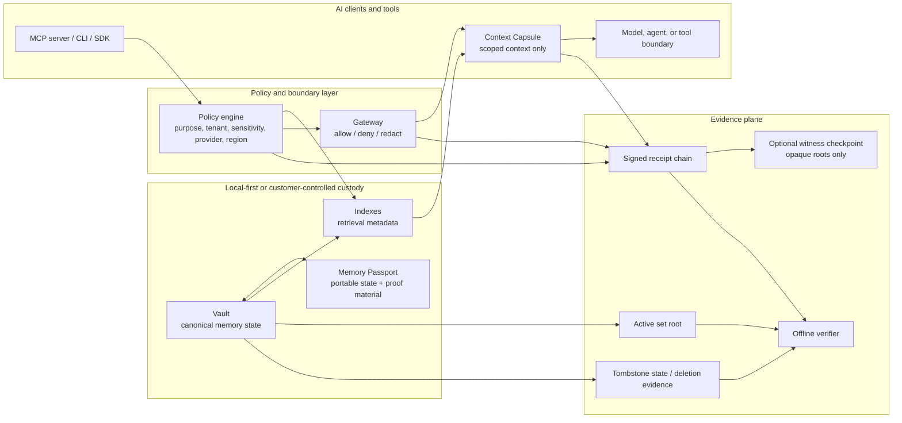
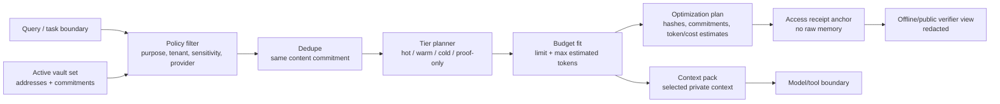
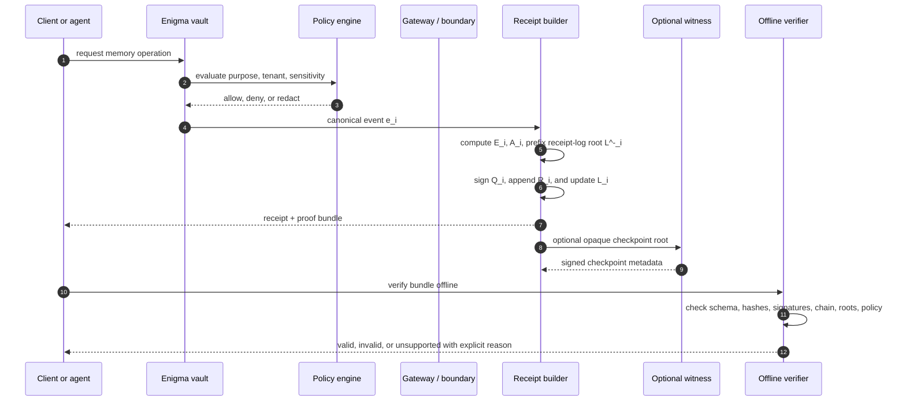

# Enigma whitepaper

## Abstract

Enigma is provider-neutral AI memory/proof infrastructure. It gives users, developers, and enterprises a canonical memory vault, a portable Memory Passport, scoped context delivery into AI clients, and signed receipts for Enigma-mediated memory lifecycle and boundary events.

AI is becoming stateful. Assistants now remember preferences, projects, identities, workflows, and tool results. But most AI memory is trapped inside provider accounts, app-specific stores, vector databases, and opaque agent traces. Users lose continuity when they switch tools. Developers rebuild memory and audit primitives for every agent. Enterprises struggle to use durable AI memory while proving policy, retention, residency, deletion workflow, and provider-boundary decisions.

Enigma addresses that gap by separating durable memory custody from model providers. Memory can live in a local-first or customer-controlled vault. AI clients receive only scoped context capsules. Every meaningful Enigma-side operation can emit a receipt: a signed, hash-linked, offline-verifiable record of what Enigma did under a declared policy boundary.

Enigma does not claim to make providers forget, delete model weights, remove every external copy, prove factual truth, prove semantic-paraphrase absence, or eliminate all side channels. Its proof model is narrower and more useful: receipts verify declared Enigma-mediated operations, committed state, gateway decisions, relay records, witness checkpoints, and verifier outcomes.

An optional relay/witness/gateway network can extend Enigma beyond local use. Relays route encrypted capsules. Witnesses checkpoint opaque roots. Gateways enforce policy and meter access. A Solana utility token, if launched after legal review, may coordinate network access, active-service operator bonding, service settlement, and bounded governance. Local Enigma memory, MCP workflows, and offline verification must remain useful without token ownership.

## 1. Market problem

### 1.1 AI memory is becoming infrastructure

The first wave of AI products centered on prompt-response sessions. The next wave is stateful: agents remember the user, project, organization, tools, preferences, permissions, prior outputs, and long-running tasks.

Durable memory is becoming the connective tissue between models, applications, agents, and workflows. If that memory is fragmented or opaque, the user's relationship with AI becomes fragile. If it is trapped in one provider, the user loses portability. If it is not auditable, enterprises cannot govern it. If deletion claims exceed what can be proven, trust degrades.

### 1.2 Current memory systems are fragmented

AI memory today often lives in one of several places:

- provider-native memory inside a subscription or hosted model account;
- chat history or workspace history;
- application-specific databases;
- vector stores and retrieval pipelines;
- agent framework state;
- logs, traces, observability backends, and tool-call records;
- manually exported JSON, CSV, or archive files.

Each can be useful. None is a neutral, portable, proof-carrying memory layer by default.

### 1.3 Users need portability

A user may work across ChatGPT, Claude, Kimi, Cursor, local models, browser tools, command-line agents, and future assistants. The useful context is not tied to one vendor: writing style, project constraints, codebase facts, research trails, preferences, contacts, workflows, and repeated instructions should travel with the user or tenant.

Without a portable memory layer, users choose between losing continuity and surrendering the durable system of record to a single provider.

### 1.4 Developers need memory primitives

Developers building agents repeatedly solve the same problems:

- how to store memory;
- how to retrieve only relevant context;
- how to import/export memory;
- how to respect source permissions;
- how to tombstone or delete from active serving state;
- how to prove what was used;
- how to debug memory boundaries;
- how to explain trust to users and auditors.

A provider-neutral memory/proof layer lets developers integrate memory once and use it across clients, models, and deployment modes.

### 1.5 Enterprises need control and evidence

Enterprise AI programs need durable memory, but they also need governance. Security, legal, compliance, and AI platform teams ask practical questions:

- Which memory was retrieved?
- Which policy allowed it?
- Which provider, model, region, purpose, and sensitivity applied?
- Was the memory excluded after a tombstone or legal hold?
- Which key version, tenant, gateway, or boundary handled the request?
- Can the evidence be verified without trusting a dashboard?

Provider-native memory can be useful, but it is rarely enough as the enterprise system of record. Enigma's enterprise posture is to keep durable memory under local, tenant, BYOC, VPC, or on-prem control while sending providers only scoped context.

## 2. Enigma overview

Enigma is a memory custody and proof layer beneath AI applications.

The core sequence is:

```text
vault -> passport -> policy -> scoped retrieval -> context capsule -> model/tool boundary -> receipt -> verifier -> optional witness checkpoint
```


The architecture separates custody, selection, boundary enforcement, and evidence. Providers and agent frameworks can use the resulting context, but they do not become the canonical memory system of record.



### 2.1 Design goals

Enigma is designed to be:

1. **Provider-neutral:** usable across model providers, local models, AI apps, and agent frameworks.
2. **Local-first:** able to run with a local vault and local verification path.
3. **Portable:** able to package memory and proof material into Memory Passports and Capsules.
4. **Verifiable:** able to produce receipts that verify offline.
5. **Policy-aware:** able to bind memory use to purpose, subject, tenant, sensitivity, region, provider, model, and gateway decisions.
6. **Plaintext-minimizing:** able to keep raw memory out of relay records, witness checkpoints, SIEM events, and public proof artifacts.
7. **Honest:** explicit about what Enigma can and cannot prove.

### 2.2 Definitions

| Term | Definition |
| --- | --- |
| Vault | The canonical Enigma-controlled memory store for a user, team, tenant, or deployment. |
| Memory object | A committed memory record, usually with subject, purpose, tags, policy metadata, and encrypted or committed payload state. |
| Memory Passport | A portable package of memory state, metadata, and proof material that can move between clients or deployment modes. |
| Memory Capsule | A scoped context package prepared for a specific purpose, query, tool, model call, tenant flow, or boundary. |
| Scoped context | The minimum relevant memory context selected under declared purpose and policy constraints. |
| Receipt | A signed, canonical, hash-linked record of an Enigma-mediated memory or boundary event. |
| Boundary receipt | A receipt describing an observed or enforced boundary operation, such as context injection, denial, provider/model decision, relay push, witness checkpoint, or gateway decision. |
| Verifier | Tooling that checks receipt signatures, ordering, commitments, roots, schemas, policies, and failure states offline where applicable. |
| Gateway | Enterprise or network service that enforces provider/model/tool/region/purpose policy and signs decisions. |
| Relay | Optional service that stores or routes opaque encrypted records, not raw memories. |
| Witness | Optional service that attests compact commitments, roots, receipt IDs, and checkpoint metadata without seeing plaintext memory. |
| Checkpoint | A compact commitment to a batch or state root that can be witnessed or anchored. |
| Tombstone | An Enigma state transition that removes a memory from active serving and preserves evidence of the lifecycle event. |
| Enigma-mediated event | An event performed, observed, or enforced by Enigma software under a declared boundary. |

## 3. Architecture

### 3.1 Local vault

The vault is the canonical memory state for local use. It can be created from the command line:

```sh
enigma init --bundle ./.enigma/bundle.json --subject local-user --display-name "Local user"
```

A local memory write, with plaintext supplied by the local operator rather than embedded in a public proof example:

```sh
enigma remember --bundle ./.enigma/bundle.json --text "$ENIGMA_DEMO_MEMORY" --purpose user_memory --tags preference
```

A context pack for a local query, again supplied outside the public artifact:

```sh
enigma context --bundle ./.enigma/bundle.json --query "$ENIGMA_DEMO_QUERY" --purpose local_answer --out ./.enigma/context-pack.json
```

Export and verify:

```sh
enigma export --bundle ./.enigma/bundle.json --out ./.enigma/export.json
enigma verify --bundle ./.enigma/export.json
```

The local bundle is the system of record for the local path. Provider-native memory should be treated as cache unless independently committed into an Enigma vault.

### 3.2 Connectors and client surfaces

Enigma exposes memory through multiple surfaces:

- CLI commands;
- MCP server;
- connector profiles for Claude Desktop, Cursor, Kimi Code, VS Code/Cline, Roo Code, OpenCode, and generic MCP;
- browser extension scaffold for explicit user-approved context insertion;
- desktop scaffold for vault, clients, receipts, import/export, deletion workflow, mesh, and enterprise screens;
- relay and gateway servers for optional network and enterprise modes.

The current MCP server exposes tools such as `enigma_init`, `enigma_remember`, `enigma_search`, `enigma_context_pack`, `enigma_delete`, and `enigma_verify_receipts`, plus the `enigma://passport/summary` resource and `enigma_standard_memory_prompt` prompt.

### 3.3 Policy and boundary layer

The policy layer determines whether memory can be retrieved, packed, injected, denied, exported, tombstoned, relayed, witnessed, or passed through a gateway. Policies may account for:

- user, subject, tenant, and controller;
- purpose and workflow;
- provider and model;
- region and residency;
- sensitivity and classification;
- source permissions and ACL references;
- key version and custody mode;
- legal hold or retention state;
- gateway mode and deployment boundary.

Policy decisions should produce receipts or be referenced by receipts through policy hashes and version identifiers.

### 3.4 Receipts and proof bundle

Receipts are the proof primitive. A proof bundle can contain:

- receipt records;
- schema identifiers;
- signature metadata;
- event hashes;
- previous receipt hashes;
- state roots;
- membership or non-membership evidence where implemented;
- tombstone evidence;
- gateway decision data;
- relay record IDs;
- witness checkpoint data;
- verifier input and output metadata;
- explicit claim boundaries.

The bundle should avoid raw plaintext in public or network-facing contexts. Sensitive content should remain encrypted, redacted, committed, or locally held depending on the deployment mode.

## 4. Memory Passport

### 4.1 Purpose

The Memory Passport is the user- and tenant-facing portability artifact. It packages durable context and proof material so memory can move across AI clients without making a provider account the canonical store.

A Memory Passport is not a public profile and not a blockchain object. It is a controlled package whose contents and disclosure depend on custody mode, encryption, policy, and recipient.

### 4.2 Contents

A Memory Passport may include:

- encrypted memory payloads;
- memory IDs and addresses;
- subject and controller metadata;
- tags, purpose, source references, and limitations;
- policy references;
- tombstone records;
- receipt chains;
- verifier summaries;
- import provenance;
- export metadata;
- optional checkpoint references.

### 4.3 Lifecycle

Typical lifecycle events include:

1. **Initialize:** create vault and passport identity.
2. **Import:** normalize source memory exports into candidates with source limitations.
3. **Commit:** write selected candidates to Enigma vault state.
4. **Retrieve:** select memories under purpose and policy constraints.
5. **Pack:** generate scoped context for a client/model/tool call.
6. **Inject or deny:** cross or block a declared boundary.
7. **Update:** revise metadata or memory state under policy.
8. **Export:** produce a portable proof bundle.
9. **Tombstone:** remove from active Enigma serving state while preserving lifecycle evidence.
10. **Verify:** check receipts and proof material offline.

### 4.4 Import limits

Enigma can import or normalize memory exports from other systems, but an import is only as complete as the source export. Enigma must preserve source limitations. A provider export does not prove provider-side completeness unless the source independently proves it.

Imported memory becomes Enigma-canonical only after it is committed through an Enigma vault and receives Enigma receipts.

### 4.5 Why a separate memory/proof layer

Provider-native memory, vector databases, and agent frameworks are useful components. Enigma is not better because it makes the underlying model smarter, faster, or cheaper in an unmeasured way. Its advantage is structural: it gives memory a neutral system of record, custody model, and proof artifact that can survive client, provider, and framework changes.

| Layer | Useful for | Missing when used alone | Enigma role |
| --- | --- | --- | --- |
| Provider-native memory | In-product personalization and convenience | Portability across providers, customer-controlled custody, offline-verifiable receipts, and independent deletion evidence | Treat as cache or destination context; keep Enigma vault as canonical for Enigma-managed memory |
| Vector database or RAG index | Similarity search, retrieval, ranking, and application memory | User-owned passport, signed lifecycle chain, tombstone evidence, boundary receipts, and provider-neutral packaging | Use as an implementation/index tier behind committed vault state and receipt roots |
| Agent framework state | Tool orchestration, traces, checkpoints, and session continuity | Durable cross-client custody, policy-bound context export, independent proof bundle, and stable memory identity | Wrap agent state with Memory Passport, context capsules, and receipt verification |

The practical difference is auditability. A vector hit or agent trace can show what an application did in its own stack. An Enigma proof bundle should show, offline, that a memory operation was canonicalized, signed, ordered, committed against the implemented active-set and receipt-log roots, and bounded by a declared policy.

### 4.6 Optimized memory fabric

The memory analogue to inference optimization is not decentralized storage. It is a fast memory-control plane that decides which committed memories should enter a model call, which memories should be represented by a compact pointer, and which memories should stay out of the prompt while remaining provable by receipt roots.

Let `M = {m_1, ..., m_n}` be the active Enigma memory set for a subject or tenant. Each memory has a committed address `a_i`, a content commitment or hash `h_i`, policy metadata `p_i`, and an estimated token contribution `t_i`. A task request supplies purpose, provider/model boundary, policy, and an optional prompt budget `B`.

The unoptimized baseline context cost for a request is:

$$
T_{\text{base}} = T(q) + \sum_{m_i \in M'} t_i
$$

where `q` is the current query/prompt and `M'` is the candidate memory subset permitted by policy and active-state membership.

The optimizer assigns each candidate to a tier:

$$
\tau_i \in \{\text{hot}, \text{warm}, \text{cold}, \text{proof-only}\}
$$

and each tier has an explicit prompt-token representation cost:

$$
c(\tau_i, t_i)=
\begin{cases}
t_i & \tau_i=\text{hot}\\
\min(t_i,\lceil \rho t_i\rceil) & \tau_i=\text{warm}\\
\min(t_i,\kappa) & \tau_i=\text{cold}\\
\min(t_i,\pi) & \tau_i=\text{proof-only}
\end{cases}
$$

The optimized prompt estimate is:

$$
T_{\text{opt}} = T(q) + \sum_{m_i \in S} c(\tau_i, t_i)
$$

subject to:

$$
S \subseteq M', \quad T_{\text{opt}} \le B \text{ when a budget is supplied}
$$

The reported reduction is an estimate over explicit inputs, not a provider invoice:

$$
\Delta_{\text{tokens}} = T_{\text{base}} - T_{\text{opt}}, \qquad
\Delta_{\%} = 100 \cdot \frac{\max(0,\Delta_{\text{tokens}})}{\max(1,T_{\text{base}})}
$$

If a price `r` per one million input tokens is supplied, Enigma can estimate request-local cost:

$$
C(T,r)=\frac{T}{1{,}000{,}000}r
$$

The production metering surface records the same idea without raw memory:

$$
u=(tenant, provider, model, T_{\text{prompt}}, T_{\text{out}}, T_{\text{base}}, T_{\text{opt}}, r_{\text{in}}, r_{\text{out}})
$$

and computes Enigma-side estimated memory credit as:

$$
Credit(u)=\frac{(T_{\text{base}}-T_{\text{opt}})r_{\text{in}}}{1{,}000{,}000}
$$

subject to:

$$
0 \le T_{\text{opt}} \le T_{\text{base}}
$$

`@enigma-ai/enigma/metering` emits `enigma.usage_event.v1` and `enigma.usage_aggregate.v1` artifacts for this accounting boundary. The artifacts contain counts, hashes, identifiers, and claim boundaries only; they are not provider invoices and not token ROI evidence.

These equations are useful because they keep the product claim measurable. Enigma may say that it estimates and reports context reduction for a named input. Enigma must not claim a universal discount, benchmark lead, provider billing reduction, token ROI, provider deletion, model forgetting, or compliance outcome from these estimates.


The repository includes a local fixture benchmark command for this method:

```sh
npm run memory:benchmark
```

The command emits `enigma.memory_optimization_benchmark.v1` with private fixture text omitted, `content_hash` redacted in public output, explicit pricing input, duplicate-removal counts, token estimates, and claim boundaries. It is evidence that the package measures its own fixture behavior; it is not a public provider-invoice or universal-savings benchmark.



The important separation is between private context and public evidence. The context pack can contain private local memory because it is the material being sent to an authorized client/model boundary. The optimization plan and access receipt must be plaintext-minimized: addresses, hashes, commitments, counts, tiers, token estimates, and cost estimates only.

This lets Enigma compete with provider-native memory, vector stores, prompt-compression tools, and model routers on a different axis. A model router optimizes which model handles a call. A vector database retrieves chunks. A prompt compressor rewrites text. Enigma owns the durable memory boundary: active-state membership, tombstones, policy-scoped selection, receipts, offline verification, and portable proof material. The optimizer makes that boundary cheaper to use by reducing repeated context before inference; blockchain, if used, anchors opaque commitments or access/settlement records outside the hot path.

## 5. Receipt and proof protocol

### 5.1 Receipt objective

A receipt should answer: what Enigma-mediated event happened, under which declared boundary, at which position in the receipt chain, against which committed state, under which policy, and with which signature?

A receipt should not claim more than that.

### 5.2 Concise formal model

Let `C(x)` be the protocol's deterministic canonical encoder and let `H(domain, x)` be a collision-resistant, domain-separated hash over canonical bytes. Domains are explicit strings such as `enigma.event.v1`, `enigma.receipt_body.v1`, and `enigma.receipt.v1`.

For an Enigma-mediated event `e_i` at sequence `i`:

$$
E_i = H(\text{"enigma.event.v1"}, C(e_i))
$$

The implemented signed receipt body `b_i` commits to the event and the receipt-chain context:

$$
b_i = C(
  schema_i,\ receipt\_id_i,\ op_i,\ subject_i,\ tenant_i,\ seq_i,\ time_i,\ E_i,\ R_{i-1},\ A_i,\ L^-_i,\ signer_i(key\_id),\ optional_i
)
$$

where `R_{i-1}` is the previous receipt hash, `A_i` is the active-set root after the Enigma state transition, and `L^-_i` is the prefix receipt-log root over the receipts that existed before receipt `i` was appended. `signer_i` is the implemented signer object, including the signing algorithm and `key_id` key reference used for verification. The optional descriptor set `optional_i` contains only implemented receipt fields when present, such as memory address, source address, policy ID, provider, and model. Provider, model, gateway, relay, witness, and policy details that are not implemented as receipt fields must be carried by the event, gateway decision, checkpoint, or verifier input they belong to rather than invented as signed receipt fields.

The receipt body hash and signed receipt hash are:

$$
Q_i = H(\text{"enigma.receipt_body.v1"}, b_i)
$$

$$
\sigma_i = Sign_{sk_i}(Q_i)
$$

$$
R_i = H(\text{"enigma.receipt.v1"}, C(b_i,\ \sigma_i))
$$

The receipt chain is valid at position `i` when:

$$
Verify_{pk_i}(Q_i,\sigma_i)=true \land b_i.previous\_receipt\_hash = R_{i-1}
$$

The active memory root is a commitment to memory addresses eligible for Enigma serving at sequence `i`:

$$
A_i = MerkleRoot(\{addr(m) : m \in Active_i\})
$$

The receipt-log root after appending `R_i` is:

$$
L_i = MerkleRoot(\{R_0,\ldots,R_i\})
$$

The package schema does not currently define a separate signed deletion root field inside each receipt. Tombstone/deletion evidence is represented by Enigma events, tombstone state, active-set absence, export bundles, and optional checkpoints where implemented. That evidence proves Enigma state-transition behavior only; it does not prove provider deletion, model forgetting, semantic forgetting, or erasure from external logs, backups, screenshots, or human knowledge.

A context proof for a model/tool boundary contains implemented commitments and membership evidence, not public raw memory:

$$
\Pi_i = \{R_i,\ A_i,\ L_i,\ policy\_or\_decision\_refs,\ selected\_commitments,\ merkle\_paths,\ redactions,\ signatures,\ tombstone\_or\_export\_evidence,\ optional\_checkpoint\}
$$

The public artifact may disclose:

$$
\Phi_i = C(R_i,\ A_i,\ L_i,\ commitments,\ redacted\ metadata,\ verifier\ result)
$$

while plaintext memory remains local, encrypted, or otherwise disclosed only inside the authorized context capsule.

Verification complexity for a bundle with `n` receipts, `s` signatures, and `k` memory membership proofs over an active set of size `M` is:

$$
O(n + s + k \log M)
$$

plus canonical decoding and schema validation. Root comparison is constant time after proof reconstruction. Offline verification should not require a call to Enigma servers, model providers, relays, or witnesses when the bundle contains the required signatures, roots, and checkpoints.

The trust boundary can be written as:

$$
Claim_{valid} = Verified(\Pi_i) \land Operation \in Boundary_{Enigma}
$$

Claims outside the Enigma boundary require independent evidence:

$$
ProviderDeletion \lor ModelForgetting \lor ExternalSideChannelAbsence \not\Leftarrow Verified(\Pi_i)
$$

This equation is the core proof discipline: Enigma receipts establish signed, ordered, committed Enigma-mediated operations under a declared boundary, not facts beyond that boundary.

Named protocol commitments:

- **Canonical event hash:** `E_i` is the deterministic hash of the canonical Enigma event.
- **Receipt hash:** `R_i` is the deterministic hash of the signed receipt body and signature.
- **Receipt chain:** every non-genesis receipt body names `R_{i-1}` in `previous_receipt_hash`; an offline verifier rejects gaps, reordering, or mutation.
- **Active set root:** `A_i` commits to memory addresses currently eligible for Enigma serving.
- **Receipt-log root:** `L^-_i` is the prefix root embedded in the receipt, and exported bundle state can carry `L_i`, the root after appending the receipt.
- **Tombstone/deletion evidence:** the current implementation represents deletion by events, tombstone state, active-set absence, export receipts, and optional checkpoints rather than a separate signed deletion root field.
- **Context proof / public artifact:** `Π_i` is the verifier proof bundle; `Φ_i` is the redacted public artifact that can expose roots, commitments, signatures, and verifier results without raw memory plaintext.
- **Verification complexity:** receipt-chain verification is linear in receipt count plus logarithmic Merkle proof work for selected memories.
- **Trust boundary equation:** a valid Enigma claim requires both a verified proof bundle and an operation inside the declared Enigma boundary.




### 5.3 Receipt fields

A professional public schema should include, at minimum:

- schema name and version;
- receipt ID;
- event type;
- event timestamp or logical sequence;
- subject, tenant, or controller reference, when appropriate;
- memory ID/address or redacted commitment;
- purpose and sensitivity metadata;
- policy ID/hash and policy version when implemented;
- previous receipt hash;
- canonical event hash;
- active-set root;
- receipt-log root;
- context proof or public artifact hash, when applicable;
- checkpoint root, export evidence, tombstone evidence, or witness reference, when applicable;
- signer identity and signature;
- key version or signing authority reference;
- implemented boundary metadata such as provider or model, plus gateway, relay, or witness descriptors where those surfaces define signed artifacts;
- explicit proof boundary statement;
- verifier status or required verifier inputs.

### 5.4 Event types

Recommended receipt event types, board/legal-review required for public schema naming:

- `vault.initialized`
- `memory.import_candidate.created`
- `memory.created`
- `memory.retrieved`
- `context_pack.created`
- `boundary.injected`
- `boundary.denied`
- `memory.updated`
- `memory.exported`
- `memory.tombstoned`
- `delete_request.recorded`
- `relay.record_pushed`
- `witness.checkpoint_signed`
- `gateway.decision_signed`
- `verifier.bundle_verified`
- `verifier.bundle_failed`

The final public names should be stable before external integrations depend on them.

### 5.5 Canonicalization

Receipts should be serialized and hashed canonically. The goal is deterministic verification across machines and time. Canonicalization should define:

- field order or canonical encoding;
- Unicode handling;
- timestamp format;
- domain-separated hash tags;
- redaction and commitment rules;
- signature input bytes;
- schema upgrade behavior;
- backward-compatible verifier behavior.

### 5.6 Ordering

Receipts should be ordered with hash links and/or state roots. A verifier should be able to detect:

- missing receipts;
- broken hash links;
- signature mismatch;
- schema mismatch;
- policy hash mismatch;
- receipt replay outside declared context;
- attempted mutation of a committed field;
- inconsistent tombstone state.

### 5.7 Offline verification

Offline verification is a core product promise. A verifier should not need to contact Enigma servers or model providers to check a self-contained proof bundle.

Local verification command:

```sh
enigma verify --bundle ./.enigma/export.json
```

A valid verification result can support statements about Enigma-controlled state and Enigma-mediated events. It cannot establish external-provider deletion, model forgetting, truth of memory content, or absence of all side channels.

### 5.8 Failure states

Verification failure should be explicit and useful. Failure reasons may include:

- invalid schema;
- unsupported schema version;
- missing required field;
- invalid signature;
- unknown signing authority;
- hash-chain break;
- state-root mismatch;
- policy mismatch;
- tombstone contradiction;
- relay/witness checkpoint mismatch;
- expired or revoked key reference;
- malformed redaction or commitment;
- unsupported extension or future feature.

## 6. MCP installability

MCP is the shortest path to putting Enigma memory into existing AI workflows. The client starts `enigma-mcp` over stdio and points it at a local bundle.

Run the MCP server:

```sh
ENIGMA_BUNDLE="$HOME/.enigma/bundle.json" enigma-mcp
```

CLI equivalent:

```sh
ENIGMA_BUNDLE="$HOME/.enigma/bundle.json" enigma mcp serve
```

Generic MCP client configuration:

```json
{
  "mcpServers": {
    "enigma": {
      "command": "enigma-mcp",
      "args": [],
      "env": {
        "ENIGMA_BUNDLE": "/absolute/path/to/.enigma/bundle.json"
      }
    }
  }
}
```

Connector commands:

```sh
enigma doctor
enigma install --bundle "$HOME/.enigma/bundle.json"
enigma connect claude-desktop --bundle "$HOME/.enigma/bundle.json"
enigma disconnect claude-desktop
```

MCP lets Enigma be infrastructure rather than a destination app. The AI client can ask for memory; Enigma can search, pack, and receipt; the model receives only scoped context.

## 7. Decentralized relay/witness/gateway network

### 7.1 Network role

The network layer is optional. Local vaults and offline verification should work without it. The network exists for cases where users, teams, developers, or enterprises want encrypted sync, shared checkpointing, gateway access, operator coordination, and public accountability of opaque proof roots.

The network must not become a plaintext memory database. Raw memories, prompts, transcripts, embeddings, ACLs, and personal metadata should not be put on-chain or into public witness logs.

### 7.2 Relay

A relay stores or routes opaque encrypted records. It should not receive raw memory fields. The local relay path:

```sh
enigma relay demo
enigma relay serve --host 127.0.0.1 --port 8787
```

Example relay health check and opaque push:

```sh
curl http://127.0.0.1:8787/health
curl -X POST http://127.0.0.1:8787/relay/push \
  -H 'content-type: application/json' \
  --data '{"capsule_id":"cap_local_1","opaque_encrypted_record":"age1-example-ciphertext-only"}'
```

Relay records should contain encrypted payloads, commitments, record IDs, expiry or retention metadata, and routing metadata necessary for service. They should reject plaintext-looking memory fields.

### 7.3 Witness

A witness attests compact proof material:

- receipt IDs;
- state roots;
- Merkle roots;
- operator IDs;
- policy or schema versions;
- checkpoint sequence;
- timestamp or slot context;
- quorum membership.

Witnesses should not see plaintext memory. Their role is to make later equivocation, omission, or mutation harder by signing compact commitments.

### 7.4 Gateway

A gateway enforces policy and signs decisions before memory crosses a model, tool, region, tenant, or network boundary. The local gateway path:

```sh
enigma gateway demo
enigma gateway serve --host 127.0.0.1 --port 8797
```

Health, policy, decision, and SIEM export:

```sh
curl http://127.0.0.1:8797/health
curl http://127.0.0.1:8797/policy
curl -X POST http://127.0.0.1:8797/gateway/decision \
  -H 'content-type: application/json' \
  --data '{"schema":"enigma.gateway_request.v1","operation":"retrieve","provider":"kimi","model":"kimi-k2","region":"us-east-1","purpose":"support_retrieval","sensitivity":"internal","memory_addr":"addr_committed_memory","memory_id":"mem_allowed","subject_id":"employee_123"}'
curl http://127.0.0.1:8797/siem/export
```

The gateway does not call model providers in the documented local path. It evaluates Enigma policy and emits signed decisions.

### 7.5 Network service units

Recommended draft service units, board/legal-review required:

- relay write;
- relay byte-period;
- relay retrieval/egress;
- witness checkpoint signature;
- witness quorum batch;
- gateway policy decision;
- proof anchoring batch;
- verifier challenge submission;
- priority routing job.

Service units should be defined operationally, not by external trading metrics.

## 8. Enterprise control plane

### 8.1 Deployment modes

Enigma supports several deployment patterns:

- **Local:** individual or developer runs vault, CLI, MCP, and verifier locally.
- **Team:** shared team processes and connectors with controlled bundle paths and policy.
- **Hosted:** Enigma operator runs relay/gateway for a tenant. This requires deployment credentials, domain, TLS, durable storage, KMS/secrets, monitoring, backups, and incident response.
- **BYOC:** customer runs relay/gateway in its own cloud or network. Customer controls KMS, network policy, logs, SIEM export, deployment credentials, and residency.
- **On-prem or air-gapped:** customer-controlled infrastructure with local verification and restricted egress.

### 8.2 Controls

Enterprise controls can include:

- tenant-scoped vaults;
- SSO/SCIM and RBAC;
- KMS/BYOK key references;
- provider, model, and region allowlists;
- purpose and sensitivity policies;
- ACL re-checks;
- legal hold and retention flags;
- deletion workflow and tombstone receipts;
- policy replay by hash/version;
- SIEM and eDiscovery exports with minimized plaintext;
- gateway-signed decisions;
- offline verifier packages for auditors.

### 8.3 Audit use cases

Enigma can support answers to questions such as:

- Was a memory in active Enigma serving state at a given time?
- Was a memory tombstoned before a later retrieval request?
- Which gateway policy allowed or denied a retrieval?
- Which provider, model, region, purpose, and sensitivity were declared?
- Which key version and policy hash were referenced?
- Did a proof bundle verify offline?

Enigma cannot independently answer whether a model provider retained hidden copies, whether a model's weights changed, or whether an external system deleted derived data unless that external system supplies independent evidence.

## 9. Solana utility token role

### 9.1 Product-first principle

The token plan must not obscure the product. Enigma is useful as local memory/proof infrastructure before any token is launched. Local vaults, MCP workflows, and offline receipt verification should remain available without token ownership.

Recommended token boundary sentence, board/legal-review required:

> The Enigma token, if launched, is intended for utility, governance, and network access within optional relay/witness/gateway infrastructure; it is not equity, not a revenue share, not a claim on company assets or user data, and not marketed with any expectation of profit.

### 9.2 Utility functions

A Solana utility token may support:

- **Network access:** submit jobs for relay, witness, gateway, anchoring, or challenge services where legally available.
- **Service settlement:** pay operators for verified relay/witness/gateway work under published rules.
- **Operator bonding:** require active operators to bond tokens as service-accountability collateral.
- **Anti-spam:** make network job submission costly enough to discourage abuse.
- **Bounded governance:** vote on protocol parameters, schema upgrades, witness admission, fee schedules, grants, and verifier requirements.

The implemented local package boundary for this is `@enigma-ai/enigma/settlement`. It emits hash-only permissionless jobs, operator quotes, service settlement receipts, and settlement batches:

$$
job=(tenant, job\_type, memory\_root, policy\_hash, usage\_hash, max\_price, asset, expiry)
$$

$$
quote=(job\_hash, operator, service\_kind, price, asset, capacity\_ref, terms\_ref)
$$

$$
settlement=(job\_hash, quote\_hash, usage\_hash, memory\_root, policy\_hash, amount, asset, service\_receipt)
$$

with:

$$
settlement.amount \le quote.price \le job.max\_price
$$

This is the practical version of the thesis: permissionless access and settlement can be open, while the raw-memory hot path stays centralized or BYOC-controlled for latency, privacy, and cost control.

Governance must not control private user memories, company equity, company revenue, employee decisions, customer contracts, or retroactive modification of receipts.

### 9.3 Enterprise access without token custody

Enterprise customers should be able to use Enigma through normal procurement paths. A gateway or managed service may abstract network settlement so customers can pay by invoice, card, fiat, SOL, USDC, or another approved method while the gateway handles any required token mechanics. This preserves network utility without forcing every user or enterprise admin into direct token custody.

### 9.4 Solana implementation facts

Solana SPL tokens use **Mint Accounts** to represent a specific token and store global metadata such as supply, decimals, mint authority, and freeze authority. **Token Accounts** track balances for a specific mint and owner. Associated Token Accounts are derived token accounts commonly used as the default token account for a mint/owner pair.

Token-2022 is an extensible token program. It adds optional extensions while preserving the base mint/account layouts for compatibility. Many extensions must be planned when the mint or token account is created, and some extensions are incompatible. If Enigma uses Token-2022, extension choices should be decided before mint creation and documented clearly.

The MetadataPointer extension points to the account that stores token metadata. The TokenMetadata extension can store name, symbol, URI, update authority, and custom metadata on the mint account. Metadata storage has account-size and rent considerations.

Recommended draft implementation posture, board/legal-review required:

- Use standard SPL Token if maximum compatibility is the priority.
- Use Token-2022 only if Enigma needs specific extensions at launch and is ready to document compatibility tradeoffs.
- If Token-2022 is used, consider MetadataPointer and TokenMetadata for canonical name, symbol, URI, update authority, and custom metadata.
- Avoid reward-like or surprising extensions for the base utility token unless counsel and engineering approve a specific non-financial need.
- Keep transfer mechanics simple; implement service escrow, operator registry, bonding, slashing/challenges, witness anchoring, and treasury/governance logic in separate programs where needed.

Recommended draft token display metadata, board/legal-review required:

- Name: `Enigma Network`
- Symbol: `ENIGMA`
- URI: `https://enigma.ai/token/enigma-network.json`
- Update authority: 3-of-5 Enigma launch multisig for publication, with a documented handoff path to governance/timelock after technical and legal signoff.
- Custom metadata: `protocol=enigma`, `network_role=relay-witness-gateway utility and governance`, `notice=not equity; no revenue share; no claim on user data`.

### 9.5 Authority map requirement

Before any token publication, Enigma should disclose:

- mint authority;
- freeze authority, if any;
- metadata update authority;
- Token-2022 extension authorities, if any;
- staking/bonding program upgrade authority;
- receipt/witness program upgrade authority;
- treasury authority;
- gateway registry authority;
- multisig thresholds;
- timelocks;
- emergency controls;
- sunset or renunciation path.

No public token launch page should ship without legal review, technical signoff, and full authority mapping.

## 10. Roadmap

### 10.1 Shipped/current foundation

Current repository-facing foundation includes:

- CLI;
- verifier;
- vault and passport logic;
- boundary harness;
- MCP server;
- connector profiles;
- importer APIs;
- relay and gateway local servers;
- enterprise policy surfaces;
- mesh/network scaffolding;
- browser-extension scaffold;
- desktop scaffold;
- package command bins and module entry points for local install and publication work.

### 10.2 Near-term product priorities

Recommended near-term priorities:

1. publish package from approved deployment credentials;
2. stabilize receipt schemas and verifier outputs;
3. ship MCP quickstart and sample proof bundles;
4. harden connectors for supported clients;
5. package desktop and browser surfaces for normal users;
6. define enterprise pilot templates;
7. publish trust model and proof boundary docs;
8. prepare external security review.

### 10.3 Network priorities

Recommended network priorities:

1. define relay/witness/gateway service units;
2. publish operator role requirements;
3. test encrypted relay and witness checkpoints on controlled testnet infrastructure;
4. implement challenge and slashing rules only where objective evidence exists;
5. publish governance non-powers and authority maps;
6. run legal review before token publication;
7. keep token content subordinate to product proof.

### 10.4 Long-term direction

Longer-term Enigma can become a neutral standard layer for AI memory portability and evidence:

- Memory Passport compatibility across clients;
- open receipt schemas and verifier tooling;
- enterprise gateway deployment templates;
- partner adapters for memory engines and model gateways;
- witness networks for opaque checkpoint roots;
- developer certification and conformance fixtures;
- customer-controlled and hosted deployment modes.

## 11. Threat model

### 11.1 Protected assets

Enigma should protect:

- memory plaintext;
- vault keys and signing keys;
- receipt integrity;
- policy integrity;
- memory lifecycle state;
- tombstone state;
- gateway decision logs;
- relay encrypted records;
- witness checkpoint correctness;
- verifier trustworthiness;
- tenant, subject, and metadata confidentiality.

### 11.2 In-scope threats

In-scope threats include:

- local proof-bundle tampering;
- receipt mutation or deletion;
- hash-chain rewriting;
- invalid signature injection;
- replayed receipt in wrong context;
- stale policy use;
- relay plaintext leakage attempts;
- gateway policy bypass attempts;
- witness equivocation;
- operator misreporting;
- unauthorized memory retrieval;
- metadata overexposure in logs or checkpoints;
- accidental provider-native memory dependence.

### 11.3 Out-of-scope threats and non-guarantees

Enigma does not claim to solve:

- provider-internal retention, hidden memory, telemetry, training, fine-tuning, or cache behavior;
- model weight forgetting;
- deletion from screenshots, backups, external logs, users' devices, third-party exports, or human memory;
- factual truth of memory content;
- model intent or hidden reasoning;
- all side channels outside instrumented boundaries;
- compromise of an endpoint before Enigma can protect data;
- legal compliance as an automatic outcome.

### 11.4 Trust assumptions

Enigma assumes:

- users or tenants protect vault files and keys;
- deployed software matches the verified build or documented version;
- signing keys are controlled according to the disclosed authority model;
- policies are configured correctly;
- clients correctly launch the configured MCP server;
- relays and witnesses can fail or misbehave and should be checked by receipts, checkpoints, quorums, challenges, and audits;
- external providers are outside the Enigma proof boundary unless they supply independent evidence.

## 12. Risks

### 12.1 Technical risk

Receipt schemas can be incomplete, verifier implementations can have bugs, key management can fail, policies can be misconfigured, connectors can break as clients change, and network operators can become unavailable.

Mitigation: keep local verification simple, publish schemas and failure states, version policies, minimize plaintext, rotate keys carefully, and subject cryptographic and network code to review.

### 12.2 Privacy and metadata risk

Even hashes, commitments, timing, sizes, operator IDs, and policy metadata can leak information. Opaque does not mean risk-free.

Mitigation: minimize metadata, batch checkpoints, avoid raw memory in public artifacts, use encryption and redaction, and document what metadata each mode exposes.

### 12.3 Operational risk

Hosted relay/gateway operation requires durable storage, KMS/secrets, TLS, monitoring, backups, incident response, access controls, and tenant policy. Installing the package does not create a production cloud service.

Mitigation: separate local, hosted, BYOC, and on-prem modes; publish deployment requirements; avoid claiming hosted behavior until infrastructure is deployed.

### 12.4 Governance risk

Governance can fail, be captured, fail to reach quorum, or make poor parameter decisions.

Mitigation: bound governance powers, use timelocks, disclose emergency controls, protect private memory from governance reach, and publish transparency reports.

### 12.5 Token and legal risk

Digital-token legal treatment varies by jurisdiction. Network services may fail, pause, change, or be discontinued. Wallet support, Solana congestion, program bugs, admin key compromise, custody mistakes, and eligibility restrictions can affect utility.

Mitigation: legal review before publication, no financial-return claims, no passive reward framing, full authority disclosure, careful jurisdiction controls, and product access paths that do not require token custody.

### 12.6 Adoption risk

A neutral memory layer must be easy to install, easy to verify, and useful across clients. If setup is difficult or proof is abstract, adoption slows.

Mitigation: lead with MCP installability, sample receipts, receipt failure demos, connector docs, enterprise pilot materials, and clear trust boundaries.

## 13. Honesty contract

Enigma's public trust depends on refusing impossible claims.

### 13.1 Enigma can honestly claim

- Enigma is provider-neutral AI memory/proof infrastructure.
- A local Enigma vault can be the canonical memory state for local workflows.
- Memory Passports can make AI context portable across Enigma-compatible clients and deployment modes.
- Enigma can emit receipts for Enigma-mediated memory lifecycle and boundary events.
- Receipt bundles can be verified offline where they contain the required proof material.
- Enigma can remove a memory from active Enigma serving state and preserve tombstone evidence.
- Gateway decisions can be signed against a specific policy hash and deployment boundary.
- Relays can store opaque encrypted records without raw memory plaintext.
- Witnesses can sign checkpoint roots without seeing raw memory.

### 13.2 Enigma must not claim

- that a closed provider deleted all internal data;
- that a model forgot weights, caches, training data, telemetry, hidden personalization, semantic paraphrases, or derived state;
- that provider-native memory disappeared unless the provider supplies independent evidence;
- that imported provider exports are complete unless the source proves completeness;
- that signed memory content is factually true;
- that all side channels are absent;
- that raw memory is stored on-chain;
- that token ownership is equity, revenue share, profit right, or company ownership;
- that token participation produces financial returns, trading upside, passive compensation, reward promises, or guaranteed access;
- that Enigma automatically creates compliance outcomes.

### 13.3 Standard proof boundary sentence

Receipts prove that declared Enigma-mediated operations were signed, ordered, and committed under a stated policy boundary; they do not prove factual truth, model intent, uninstrumented side-channel absence, or deletion from external systems unless those systems provide independent evidence.

## 14. Conclusion

AI needs durable memory, but durable memory should not mean provider lock-in, opaque state, or unverifiable claims. Enigma's thesis is that memory for AI should be portable, local-first or customer-controlled, provider-neutral, and proof-carrying.

The product starts with a practical loop: install locally, connect MCP, write memory, generate receipts, export a proof bundle, and verify offline. The broader system extends that loop through Memory Passports, enterprise gateways, encrypted relays, witness checkpoints, and optional network coordination.

Enigma's opportunity is not to be another chatbot or another vector database. It is to become the neutral memory/proof substrate beneath AI applications: the memory card for AI, with receipts that say exactly what happened and exactly what they do not prove.

## Source links

Enigma local docs:

- `../README.md`
- `../docs/install-anywhere.md`
- `../docs/client-connectors.md`
- `../docs/sandisk-scale-strategy.md`

Solana docs:

- SPL token concepts, including Mint Accounts, Token Accounts, and Associated Token Accounts: https://solana.com/docs/tokens
- Token-2022 overview, strict superset framing, program address, mint/account layout compatibility, and extensions: https://www.solana-program.com/docs/token-2022
- Token extensions overview, optional extension behavior, creation-time planning, and incompatibility notes: https://solana.com/docs/tokens/extensions
- Metadata Pointer and TokenMetadata extensions, including name, symbol, URI, update authority, custom metadata, and mint-account storage considerations: https://solana.com/docs/tokens/extensions/metadata
